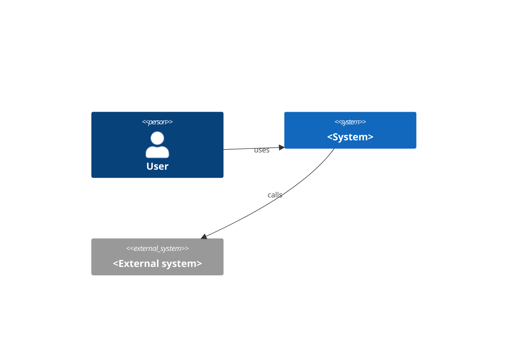

<!--
Purpose: Describe the chosen architecture against its drivers: quality attribute scenarios, constraints, C4 views, integration, cross-cutting concerns, deployment view, risks, and the index of decisions.
Producer: architecture (api-design appends §7 notes).
Consumers: data-design, api-design, security (threat model), delivery-pipeline, implementation, testing, operations, legacy-modernization.
Update when: a driver changes, a new ADR is accepted, a container is added/removed.
Size: S context + container diagrams, drivers table, ≤3 ADRs; M/L all sections. Concepts follow ISO/IEC/IEEE 42010:2022; views follow C4 (references/architecture-styles.md).
-->
# Architecture Overview — <project>

| Field | Value |
|---|---|
| Version / date | |
| Style | e.g. modular monolith — ADR-0001 |
| Size class | |
| Stack summary | from STATE.md |

## 1. Drivers (quality attribute scenarios)
| # | REQ-N | Source · stimulus · environment · artifact · response · measure | Addressed by (ADR / component) |
|---|---|---|---|

## 2. Constraints and assumptions affecting architecture
`CON-###`, `ASM-###` with implications.

## 3. Style and rationale
Chosen style, the drivers it satisfies, the costs accepted (link ADR). Distributed styles: list the explicit distribution drivers.

## 4. System Context (C4 level 1)

Elements (text): users · the system · external systems and what flows between them.

## 5. Containers (C4 level 2)
| Container | Technology | Responsibility | Communicates with (protocol) | Data owned |
|---|---|---|---|---|

## 6. Components (C4 level 3 — M/L hot spots only)
| Container | Component | Responsibility | Depends on |
|---|---|---|---|

## 7. Integration and communication
| Interaction | Sync / async | Contract (OpenAPI / GraphQL / AsyncAPI) | Failure handling (timeout, retry, idempotency, circuit breaker) | Consistency |
|---|---|---|---|---|

## 8. Cross-cutting concerns
| Concern | Decision | ADR |
|---|---|---|
| Authentication / authorization | | |
| Configuration and secrets | | |
| Error handling and error contract | | |
| Logging, metrics, tracing (correlation id) | | |
| Data lifecycle / privacy | | |
| Feature flags / compatibility policy | | |

## 9. Deployment view
| Environment | Topology (nodes, containers, managed services) | Scaling | Notes |
|---|---|---|---|

## 9b. Capacity model (L; M when a driver demands)
| Path / container | Expected load (peak, growth) | Unit cost per request | Bottleneck resource | Scaling approach | Headroom target |
|---|---|---|---|---|---|

## 10. Risks and trade-offs
| RISK | Trade-off accepted | Mitigation / trigger to revisit |
|---|---|---|

## 11. Decision index
| ADR | Title | Status |
|---|---|---|
