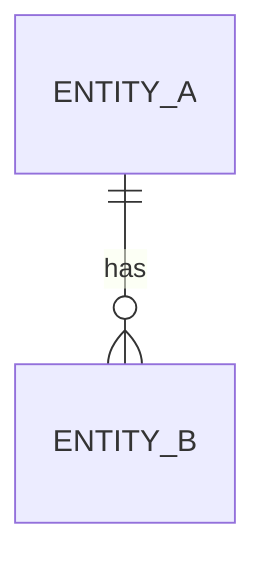

<!--
Purpose: Fix the vocabulary and the structure of the problem domain (terms, entities, relationships, invariants, lifecycles) so architecture, data and API design share one model.
Producer: domain-model.
Consumers: architecture, data-design, api-design, implementation.
Update when: a requirement introduces or changes a concept; a term is found ambiguous.
Size: S glossary + entity table + invariants; M/L add state machines and bounded contexts.
-->
# Domain Model — <project>

## 1. Glossary (ubiquitous language)
| Term | Definition (one meaning) | Synonyms to avoid | Source REQ |
|---|---|---|---|

## 2. Entities and value objects
| Name | Kind (entity / value object) | Identity | Key attributes | Owning context (M/L) |
|---|---|---|---|---|

## 3. Relationships
| From | To | Cardinality | Meaning | Constraints |
|---|---|---|---|---|

Diagram (optional):

## 4. Invariants and business rules
| ID | Rule (predicate) | Applies to | Source REQ | Enforced where (domain / DB / both) |
|---|---|---|---|---|
| INV-001 | | | | |

## 5. Lifecycles (state machines)
| Entity | States | Transitions (event → from → to, guard) | Terminal states |
|---|---|---|---|

## 6. Bounded contexts and context map (M/L)
| Context | Responsibility | Owns concepts | Relationships (upstream/downstream, shared kernel, ACL) |
|---|---|---|---|

## 7. Coverage check
| REQ-F | Concepts touched | Gap? |
|---|---|---|

## 8. Open questions
